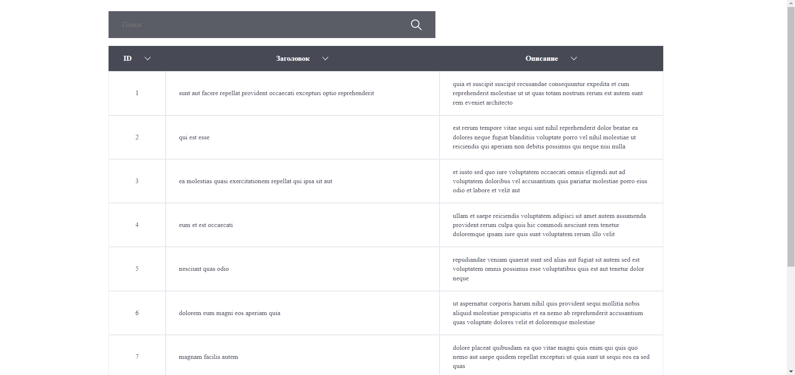

# Тестовое задание для соискателя на должность Frontend разработчик.

## Оглавление

- [Инструкции по развертыванию](#инструкции-по-развертыванию)
- [Обзор](#обзор)
  - [Общие требования](#общие-требования)
  - [Описание приложения](#описание-приложения)
  - [Скриншот](#скриншот)
  - [Ссылки](#ссылки)
- [Мой процесс](#мой-процесс)
  - [Стек](#стек)
- [Автор](#автор)

## Инструкции по развертыванию

**Для запуска проекта на вашем компьютере должны быть установлены [npm](https://nodejs.org/en/) и [git](https://git-scm.com/downloads)**

1. Сделайте клон этого репозитория ```git clone https://github.com/klekwedge/business-sector-test-task.git```
2. Установите все необходимые пакеты npm с помощью ```npm i```
3. Запустите проект командой ```npm run dev```

## Обзор

Реализовать spa в соответствии с предложенным макетом, в котором будет представлена таблица с данными пользователей и возможностью сортировки и поиска.

### Общие требования
[API](https://jsonplaceholder.typicode.com/posts)

[Макет Figma](https://www.figma.com/file/amcWeZhjaZ0eSyYiSNG6vN/%D0%9C%D0%B0%D0%BA%D0%B5%D1%82-%D1%82%D0%B0%D0%B1%D0%BB%D0%B8%D1%86%D1%8B?node-id=0%3A1)

- Приложение должно работать в chrome и firefox.
- Разрешается использовать UI фреймворки по типу bootstrap.
- Код должен быть чистым и читабельным.
- Не должно быть необоснованного дублирования, всё должно распределяться по компонентам.
- Код должен быть отформатирован в едином стиле.
- Вёрстка должна совпадать с макетами figma.
- Приложение должно быть написано на react.
- Плюсом будет использование глобального state менеджера redux.
- Приложение должно быть адаптировано под различные устройства.

### Описание приложения

- При входе на страницу отображается таблица с данными.
- На одной странице таблицы показывается только 10 записей.
- Под таблицей располагаются элементы, показывающие количество страниц таблицы.
- Кнопки “Назад” и “Далее” переключают страницы таблицы.
- Переключение между страницами происходит без перезагрузки.
- При нажатии на заголовки столбцов происходит сортировка записей (от большего к меньшему или по алфавиту).
- В строке поиска можно ввести любое значение, и в таблице отобразится запись, в которой данное значение присутствует. Поиск по всем столбцам.
- Страница таблицы должна отображаться в URL браузера.

### Скриншот



### Ссылки

- [Ссылка на проект](https://github.com/klekwedge/business-sector-test-task)
- [Деплой](https://klekwedge-business-sector-test-task.vercel.app/)

## Мой процесс

### Стек

- React
- React Router
- TypeScript
- Redux Toolkit
- SCSS

## Автор

- [Вебсайт](https://klekwedge-cv.vercel.app/)
- [Linkedin](https://www.linkedin.com/in/klekwedge/)
- [Facebook](https://www.facebook.com/klekwedge)
